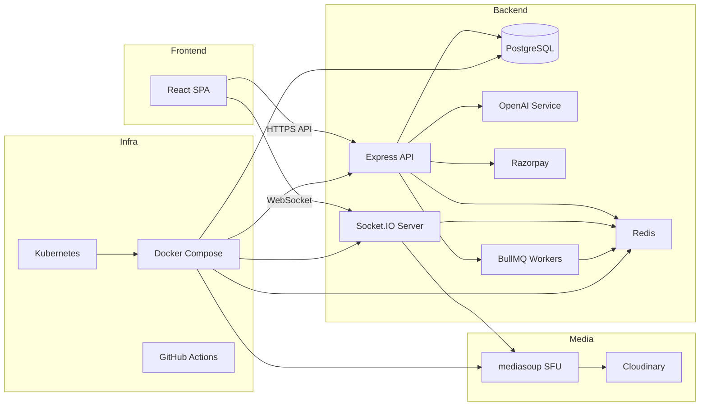

# Edemy LMS – Enterprise Real‑Time Learning Management System

[](https://github.com/Piyush200516/Edemy-LMS/blob/main/LICENSE) 
[](https://github.com/Piyush200516/Edemy-LMS/stargazers) 
[](https://github.com/Piyush200516/Edemy-LMS/network) 
[](https://nodejs.org/en/about/releases/) 
[](https://www.docker.com/) 
[](https://kubernetes.io/)

---

## 🚀 Modern Project Description

**Edemy LMS** is a production‑grade, real‑time, cloud‑ready learning‑management platform designed for massive‑scale MOOCs, corporate training, and skill‑sharing communities. It combines a **React + Vite** SPA, **Redux Toolkit**, **Tailwind CSS**, **Framer Motion**, and **React Query** on the front‑end with a **Node.js/Express** API powered by **PostgreSQL**, **Prisma ORM**, **Redis**, **Socket.IO**, **BullMQ**, and **WebRTC** on the back‑end. The platform provides:
- 📚 Course creation, enrollment, progress tracking, and certification.
- 🎥 Live, interactive classes with video streaming, screen‑share, chat, and real‑time quizzes.
- 💳 Seamless subscription billing via **Razorpay**.
- 🤖 AI‑driven tutoring, quiz generation and note‑taking (OpenAI).
- 📊 Admin analytics dashboard with live metrics.
- 🔐 Enterprise‑level security, monitoring, CI/CD, and container orchestration.

---

## ✨ Key Features

| Feature | Description |
|---------|-------------|
| **User Management** | JWT Access + Refresh tokens, Google OAuth, OTP verification, role‑based access control (RBAC). |
| **Course Engine** | CRUD for courses/lectures, soft‑delete, versioning, media assets via Cloudinary. |
| **Real‑Time Collaboration** | Socket.IO for notifications, messaging, presence; Redis Pub/Sub for horizontal scaling. |
| **Live Video Classes** | WebRTC signaling with **mediasoup** (SFU), screen‑share, raise‑hand, attendance tracking. |
| **Payments & Subscriptions** | Razorpay subscription integration, webhook validation, billing dashboard. |
| **AI Features** | OpenAI chat‑bot tutor, automatic quiz generator, note summarizer. |
| **Admin Analytics** | Real‑time dashboards powered by Redis streams and Socket.IO updates. |
| **DevOps** | Docker, Docker‑Compose, Helm chart for Kubernetes, GitHub Actions CI/CD, PM2 process manager. |
| **Observability** | Winston logging, Prometheus metrics, Grafana dashboards, Sentry error tracking. |

---

## 🔧 Tech Stack

| Layer | Technologies |
|-------|--------------|
| **Frontend** | React 18, Vite, Redux Toolkit, Tailwind CSS, Framer Motion, React Query, Socket.IO‑client |
| **Backend** | Node.js 20 LTS, Express 4, TypeScript, Prisma 5, PostgreSQL 15, Redis 7, Socket.IO 4, BullMQ, Winston |
| **Realtime** | WebRTC (mediasoup), Socket.IO‑Redis‑Adapter |
| **AI** | OpenAI SDK (gpt‑4o), Langchain adapters |
| **Payments** | Razorpay SDK |
| **Containerisation** | Docker, Docker‑Compose, Kubernetes (Helm), PM2 |
| **CI/CD** | GitHub Actions, Docker Hub, GitHub Packages |
| **Monitoring** | Prometheus, Grafana, Sentry, Loki/Promtail |

---

## 🏗️ System Architecture



---

## 📂 Folder Structure

```
.
├─ backend/                     # Node.js server
│  ├─ src/                     # TypeScript source
│  │  ├─ config/               # DB, Redis, env helpers
│  │  ├─ modules/              # Feature modules (auth, courses, payments, live‑classes, notifications, analytics)
│  │  │  ├─ auth/               # Controllers, services, repository
│  │  │  ├─ courses/
│  │  │  ├─ payments/
│  │  │  ├─ live-classes/
│  │  │  └─ notifications/
│  │  ├─ repositories/         # Generic Repository pattern (Prisma based)
│  │  ├─ socket/               # Socket.IO init & namespace handlers
│  │  ├─ utils/                # Logger, error handling, validators
│  │  └─ app.ts                # Express app (middlewares, routes)
│  ├─ prisma/                  # Prisma schema & migrations
│  ├─ Dockerfile               # Multi‑stage build
│  └─ tsconfig.json            # TypeScript config
├─ frontend/                    # React Vite app
│  ├─ src/
│  │  ├─ api/                  # React Query hooks
│  │  ├─ components/           # UI components (styled with Tailwind + Framer Motion)
│  │  ├─ pages/                # Routes (Course, Dashboard, LiveClass, Admin)
│  │  ├─ store/                # Redux Toolkit slices
│  │  └─ socket/                # Socket.IO client wrapper
│  ├─ public/                  # Static assets
│  ├─ vite.config.ts
│  └─ tailwind.config.js
├─ docker-compose.yml           # Local dev stack (postgres, redis, api, frontend)
├─ helm/                        # Helm chart for K8s deployment
├─ .github/                     # GitHub Actions workflows
├─ .env.example                 # Sample env file
└─ README.md                    # **THIS FILE**
```

---

## 📸 Screenshots (placeholders)

> **NOTE**: Replace the placeholders with actual images after you run the app.

| Screenshot | Description |
|------------|-------------|
|  | Landing page with course catalog |
|  | Course detail, progress bar |
|  | Real‑time video classroom UI |
|  | Live analytics & revenue charts |

---

## 🛠️ Installation Guide

### Prerequisites

- **Node.js 20 LTS** (`nvm install 20 && nvm use 20`)
- **Docker & Docker‑Compose**
- **Git**
- **PostgreSQL 15** (local or Docker)
- **Redis 7**

### Clone & Set Up

```bash
# Clone the repo
git clone https://github.com/Piyush200516/Edemy-LMS.git
cd Edemy-LMS

# Populate environment variables
cp .env.example .env   # edit with your credentials (DB, Redis, Cloudinary, Razorpay, OpenAI)
```

### Backend (TypeScript)

```bash
cd backend
npm install                # install deps
npx prisma generate         # generate Prisma client
npx prisma migrate dev      # apply schema to the DB
npm run dev                 # starts API with ts-node-dev (hot‑reload)
```

### Frontend (Vite)

```bash
cd ../frontend
npm install                # install deps
npm run dev                # http://localhost:5173
```

### Docker Compose (Full stack)

```bash
cd ..
docker-compose up --build   # brings up postgres, redis, api, frontend
```

---

## 🚀 Production Deployment

### Docker Build & Push

```bash
# Build multi‑stage image
cd backend
docker build -t yourdockerhub/edemy-backend:latest .

docker push yourdockerhub/edemy-backend:latest

# Frontend image
cd ../frontend
docker build -t yourdockerhub/edemy-frontend:latest .

docker push yourdockerhub/edemy-frontend:latest
```

### Kubernetes (Helm)

```bash
# Add repo (optional) and install
helm repo add edemy https://your‑helm‑repo.example.com
helm install edemy-lms ./helm/edemy-lms \
  --set image.backend.tag=latest \
  --set image.frontend.tag=latest \
  --namespace production
```

> The Helm chart includes **PostgreSQL** (Bitnami), **Redis**, **Ingress** with TLS, **Horizontal Pod Autoscaling**, and **Prometheus** ServiceMonitors.

---

## 📑 API Documentation

Swagger UI is served at `http://<host>/api-docs`. The OpenAPI spec is generated from route annotations using **swagger-jsdoc**.

---

## ⚙️ Performance Optimizations

- **Redis caching** for course catalog & auth tokens.
- **Connection pooling** (pg‑pool) and prepared statements.
- **Indexing** on frequently queried columns (`email`, `course_id`).
- **Compression** of Socket.IO payloads (`maxHttpBufferSize`).
- **Lazy‑loading** of heavy modules (AI, video transcoding).

---

## 🔒 Security Features

- **Helmet** HTTP headers, CSP, HSTS.
- **Rate limiting** (Express‑Rate‑Limit + Redis store).
- **CSRF protection** (`csurf`).
- **Secure cookies** with `SameSite=None` in production.
- **JWT rotation** and revocation list stored in Redis.
- **Input validation** via **zod** schemas.
- **OWASP‑compliant** sanitisation of user‑generated content.
- **Sentry** for real‑time error reporting.

---

## 📈 Monitoring & Logging

- **Winston** JSON logs → Loki (Grafana).
- **Prometheus** metrics exported via `prom-client` (HTTP `/metrics`).
- **Grafana dashboards** for API latency, DB connection pool, Redis hit‑ratio, active WebSocket connections.
- **Health checks** (`/health`) for Kubernetes liveness/readiness probes.

---

## 🤖 CI/CD Workflow

```yaml
name: CI/CD
on:
  push:
    branches: [ main ]
  pull_request:
    branches: [ main ]
jobs:
  build:
    runs-on: ubuntu‑latest
    steps:
      - uses: actions/checkout@v4
      - name: Set up Node
        uses: actions/setup-node@v4
        with:
          node-version: '20'
      - name: Install backend deps
        run: |
          cd backend
          npm ci
      - name: Lint & Test Backend
        run: |
          cd backend
          npm run lint
          npm test
      - name: Build Backend Docker image
        run: |
          cd backend
          docker build -t edemy-backend:${{ github.sha }} .
      - name: Push Docker image
        uses: docker/login-action@v3
        with:
          username: ${{ secrets.DOCKERHUB_USER }}
          password: ${{ secrets.DOCKERHUB_TOKEN }}
      - name: Publish image
        run: |
          docker tag edemy-backend:${{ github.sha }} yourdockerhub/edemy-backend:${{ github.sha }}
          docker push yourdockerhub/edemy-backend:${{ github.sha }}
      # similar steps for frontend …
  deploy:
    needs: build
    runs-on: ubuntu‑latest
    if: github.ref == 'refs/heads/main'
    steps:
      - name: Deploy to Kubernetes
        uses: azure/k8s‑deploy@v4
        with:
          manifests: helm/edemy-lms/templates/**
          images: |
            yourdockerhub/edemy-backend:${{ github.sha }}
            yourdockerhub/edemy-frontend:${{ github.sha }}
```

---

## 📈 Future Improvements

- **Multi‑tenant SaaS** support (tenant isolation, sub‑domains).
- **Server‑side rendering** for SEO‑critical pages.
- **GraphQL API** alongside REST for flexible data fetching.
- **Full‑text search** with Elasticsearch or Typesense.
- **AI‑assisted code generation** for auto‑creating quizzes from lecture transcripts.
- **Mobile native app** (React Native) with push notifications.
- **Advanced analytics** via data‑warehouse (Snowflake) and BI tools.

---

## 🤝 Contributors

All core development, architecture, implementation, and real‑time infrastructure were designed, built, and managed by **Piyush Mishra**.

| Name | Role |
|------|------|
| **Piyush Mishra** | Full Stack Developer, System Architect, Backend, Frontend, DevOps, Real‑Time Infrastructure, PostgreSQL, Redis, Socket.IO, WebRTC, Kubernetes, AI Integration |

Feel free to open **issues** and submit **pull requests** – all contributions are welcome!

---

## 📄 License

This project is licensed under the **MIT License** – see the `LICENSE` file for details.

---

*Happy coding! 🎓*
